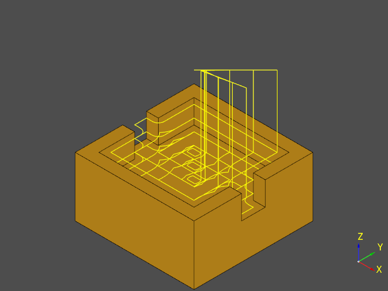
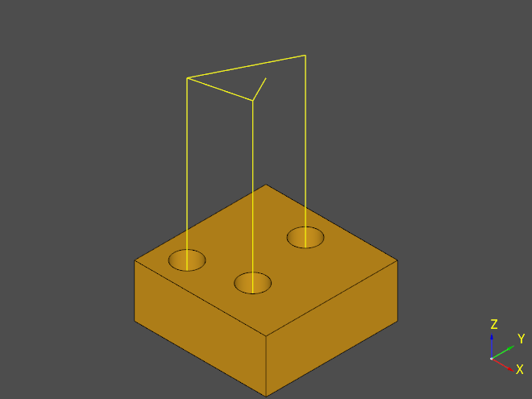
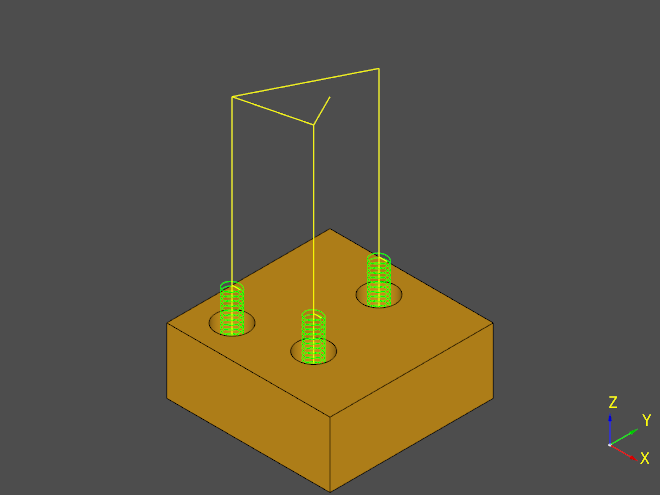

Examples
========

Profiling
--------------------

:meth:`ocp_freecad_cam.api.Job.profile` allows creating tool paths that follow face/edge contours.

.. tabs::

   .. tab:: CadQuery

        .. literalinclude :: cq_profile.py
           :language: python

   .. tab:: Build123d
        .. literalinclude :: b3d_profile.py
           :language: python

.. image:: images/cq_profile.png

2.5D Pocketing
-------------------------

:meth:`ocp_freecad_cam.api.Job.pocket` creates tool paths for pocketing / clearing holes.

.. tabs::
   .. tab:: CadQuery
        .. literalinclude :: cq_pocket.py
           :language: python
   .. tab:: Build123d (todo)

Drill
-------------------------

:meth:`ocp_freecad_cam.api.Job.drill` creates tool paths for drilling holes

.. tabs::
   .. tab:: CadQuery
        .. literalinclude :: cq_drill.py
           :language: python
   .. tab:: Build123d (todo)

Helix
-------------------------

:meth:`ocp_freecad_cam.api.Job.drill` creates tool paths for milling holes using helical motion

.. tabs::
   .. tab:: CadQuery
        .. literalinclude :: cq_helix.py
           :language: python
   .. tab:: Build123d (todo)

Adaptive
-------------------------

:meth:`ocp_freecad_cam.api.Job.adaptive` creates clearing/profiling tool paths using adaptive algorithms.

.. tabs::
   .. tab:: CadQuery
        .. literalinclude :: cq_adaptive.py
           :language: python
   .. tab:: Build123d (todo)

